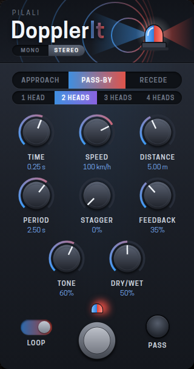

# DopplerIt



Plug-in audio de **delay Doppler** :
- **LV2** optimisé pour les **MOD Dwarf / Duo / Duo X** et le **Raspberry Pi 5**, avec un **modgui** complet pour mod-ui ;
- **VST3** (Windows, Linux, macOS) et **AU** (macOS Intel + Apple Silicon) via **JUCE**, avec une interface identique au modgui.

Les deux versions partagent exactement le même moteur DSP (`src/delay_engine.hpp`) et les mêmes paramètres.

## Principe

C'est un écho à **1 à 4 têtes en série**, comme un delay à bande multi-têtes, où chaque tête
applique un effet Doppler de **passage de véhicule** à ce qu'elle relit, comme la sirène
d'un véhicule d'urgence.

Faire varier la durée d'un delay revient à déplacer une source sonore :
- quand la durée raccourcit, le son monte (arrivée du véhicule) ;
- quand elle s'allonge, le son descend (éloignement).

Chaque cycle du LFO correspond à **un véhicule qui passe**. La durée suit la courbe de
distance réelle d'un passage en ligne droite :
- d'abord le **plateau aigu** de l'arrivée ;
- puis la **chute** au point de passage ;
- ensuite le **plateau grave** de l'éloignement ;
- enfin, au cycle suivant, le **retour instantané** à l'arrivée, le véhicule suivant.

En fin de cycle, la durée retrouve exactement sa valeur de départ ; seul son sens de
variation s'inverse. Il n'y a donc ni clic ni glissement, seulement une bascule nette
de hauteur.

Les têtes sont **en série** : chaque tête retarde de *Time* le signal de la précédente et lui
réapplique l'effet. La transposition se **cumule** d'une tête à l'autre. On entend toutes les
têtes, et la dernière est renvoyée vers la première (feedback). Aucun découpage du son :
les têtes de lecture se déplacent seulement, comme sur un delay analogique.

- 1 entrée, 2 sorties, avec un mode **Mono** ou **Stereo** (léger décalage de l'effet entre gauche et droite).
- Charge CPU : environ 1,2 % d'un cœur x86 avec 4 têtes en stéréo ; 4 Mio de mémoire à 48 kHz.

## Contrôles

| Contrôle | Plage | Rôle |
|---|---|---|
| Mode | Approach / Pass-by / Recede | Pass-by : arrivée puis éloignement, et retour instantané à l'arrivée du véhicule suivant. Approach : seulement l'arrivée (le son aigu se stabilise au point de passage). Recede : seulement l'éloignement (le son part du point de passage et descend). En Approach et Recede, chaque nouveau véhicule repart avec un fondu de 20 ms |
| Heads | 1 à 4 | Nombre de têtes en série |
| Time | 20 ms – 1,5 s | Écart entre deux têtes, identique pour toutes. Synchronisable au tempo |
| Speed | 5 – 300 km/h | Vitesse du véhicule, donc ampleur de la transposition (environ ±1,4 demi-ton par tête à 100 km/h) |
| Distance | 1 – 50 m | Distance de passage : courte, la chute de hauteur au milieu est brutale ; longue, elle est progressive |
| Period | 0,1 – 16 s | Temps entre deux véhicules (un cycle de LFO). Synchronisable au tempo |
| Stagger | 0 – 100 % | 0 % : têtes synchrones, l'effet se cumule. Au-delà : chaque tête passe plus tard que la précédente, comme plusieurs véhicules qui se suivent ; 100/N % les répartit régulièrement (25 % pour 4 têtes) |
| Feedback | 0 – 100 % | Réinjection de la dernière tête vers la première, avec une saturation douce qui garde la boucle stable |
| Tone | 0 – 100 % | Passe-bas dans chaque tête : chaque répétition s'assombrit |
| Dry/Wet | 0 – 100 % | Balance son direct / effet (les deux à plein niveau à 50 %) |
| Output | Mono / Stereo | Mono : le même signal sur les deux sorties. Stereo : effet légèrement décalé entre gauche et droite |
| Loop | on / off | On : passages en continu. Off : un passage par déclenchement |
| Pass | bouton | Lance un passage (à assigner à un footswitch) |
| Bypass | footswitch | Désignation `lv2:enabled`, avec un fondu sans clic |

**La transposition n'existe que pendant le mouvement**, comme sur un vrai delay analogique
dont on tourne le potentiomètre de durée. *Speed*, *Distance* et *Period* dessinent le
passage ; *Time* fixe l'écart entre les têtes.

### Synchronisation au tempo (mod-ui)

Les ports **Time** et **Period** déclarent `mod:tempoRelatedDynamicScalePoints`. Dans mod-ui :
1. ouvrez les paramètres du plug-in (icône ⚙) ;
2. cliquez sur l'icône d'assignation de **Time** ou **Period** ;
3. cochez **Tempo – Translate value to musical tempo** ;
4. choisissez la division (1/4, 1/2, 1 mesure, valeurs pointées ou en triolets), puis enregistrez.

Avec **Assign to: None**, la valeur suit simplement le tempo global, y compris en tap tempo
depuis le Dwarf.

Astuce : avec **Loop = off** et **Pass** assigné à un footswitch du Dwarf, chaque appui fait
passer un véhicule.

## Compilation

Dépendances : `make`, `g++` et les en-têtes LV2 (`lv2-dev`).

### Directement sur un Raspberry Pi 5

```sh
sudo apt install build-essential lv2-dev
make                 # optimisé pour le CPU de la machine (Cortex-A76 sur Pi 5)
make install-user    # installe dans ~/.lv2
# ou : sudo make install   (installe dans /usr/local/lib/lv2)
```

Le plug-in est alors utilisable dans tout hôte LV2 (MODEP / mod-ui, Carla, Ardour,
jalv, etc.).

### Pour les MOD (Dwarf, Duo, Duo X) avec mod-plugin-builder

```sh
cp -r mod-plugin-builder/dopplerit /path/to/mod-plugin-builder/plugins/package/
cd /path/to/mod-plugin-builder
./build moddwarf dopplerit           # ou modduo, modduox
# depuis une copie locale plutôt que GitHub :
DOPPLERIT_SOURCE_DIR=/path/to/DopplerIt ./build moddwarf dopplerit
# puis pour envoyer le plug-in sur l'appareil connecté en USB :
./build moddwarf dopplerit-publish
```

La recette passe `NOOPT=true` : ce sont les options CPU de mod-plugin-builder qui
s'appliquent (Cortex-A53 pour le Dwarf et le Duo X, Cortex-A7 pour le Duo).

### Version JUCE : VST3 (Windows / Linux / macOS) et AU (macOS)

Dépendances : CMake ≥ 3.22 et un compilateur C++17 :
- Windows : Visual Studio 2022 ;
- macOS : Xcode ;
- Linux : `g++` plus les paquets X11, ALSA et freetype (voir `.github/workflows/build.yml`).

JUCE 8 est téléchargé automatiquement ; on peut aussi indiquer une copie locale avec `-DJUCE_DIR=/chemin/JUCE`.

```sh
# Windows / Linux
cmake -S juce -B build-juce -DCMAKE_BUILD_TYPE=Release
cmake --build build-juce --config Release

# macOS, binaire universel Intel + Apple Silicon (VST3 + AU)
cmake -S juce -B build-juce -DCMAKE_BUILD_TYPE=Release -DCMAKE_OSX_ARCHITECTURES="arm64;x86_64"
cmake --build build-juce --config Release
```

Les plug-ins sont générés dans `build-juce/DopplerIt_artefacts/Release/` (`VST3/DopplerIt.vst3`, `AU/DopplerIt.component`).
Ajoutez `-DDOPPLERIT_STANDALONE=ON` pour obtenir aussi une application autonome.

- **macOS minimum** : 10.11 (El Capitan) pour la partie Intel, le minimum de JUCE 8. La partie Apple Silicon démarre à macOS 11, première version pour ces Mac.
- **Entrées et sorties** : entrée mono ou stéréo (sommée en mono) ; sortie mono ou stéréo. Avec une piste de sortie mono, l'effet est automatiquement l'effet mono simple.
- **Bypass** : le footswitch est le paramètre de bypass natif de l'hôte, avec un fondu sans clic.
- **Interface** :
  - même disposition 320 × 476, mêmes couleurs et mêmes images que le modgui (filmstrip du potard, footswitch, en-tête gyrophare) ;
  - même police, Cooper Hewitt : c'est celle que mod-ui impose à tous les modgui ;
  - la fenêtre est redimensionnable de 75 % à 300 %.
- **CI GitHub Actions** : chaque push compile Linux, Windows et macOS universel, valide le VST3 avec pluginval (sévérité 10), valide l'AU avec `auval` en natif et sous Rosetta, puis publie les binaires en artefacts. Un tag `v*` crée une release.
- **Signature macOS** : les binaires de la CI sont signés ad hoc. Pour les distribuer sans avertissement de Gatekeeper, il faut une signature Developer ID et une notarisation Apple. En attendant : `xattr -dr com.apple.quarantine DopplerIt.vst3`.

> **Licence JUCE** : JUCE 8 est distribué sous AGPLv3 ou sous licence commerciale JUCE (une offre gratuite existe en dessous d'un certain chiffre d'affaires). Distribuer les binaires VST3/AU impose soit de respecter l'AGPLv3, soit de disposer d'une licence JUCE. Le code de DopplerIt reste sous MIT, et la version LV2 n'utilise pas JUCE.

### Tests et démos

```sh
make test   # tests hors ligne du moteur
make demo   # fichiers WAV de démonstration dans build/demo
```

Les tests vérifient :
- les **plateaux de hauteur** (1 ± v/c) ;
- le **retour instantané** de l'éloignement à l'arrivée, avec une sortie continue ;
- l'effet de **Distance** sur la chute de hauteur ;
- le **cumul de la transposition** d'une tête à l'autre ;
- la **stabilité** avec 4 têtes et un feedback à 100 % ;
- le **mode déclenché** ;
- l'**absence de discontinuité** lors des changements de paramètres (nombre de têtes, Time, Stagger, Mono/Stereo) ;
- le **mono**, le **bypass**, la **mémoire** et la **charge CPU**.

## Structure

```
src/delay_engine.hpp        moteur DSP (sans dépendance)
src/dopplerit.cpp           enveloppe LV2
juce/                       version JUCE (VST3 / AU) : CMake, processeur, éditeur
.github/workflows/build.yml CI : LV2 + tests, VST3 Linux/Windows/macOS, AU macOS, pluginval, auval
dopplerit.lv2/              manifest, description des ports, modgui
tests/test_delay.cpp        tests hors ligne du moteur
tools/render_demo.cpp       rendu des fichiers WAV de démonstration (make demo)
tools/make_gui_images.py    génère le potard (filmstrip) et le footswitch
tools/make_screenshots.mjs  capture screenshot et thumbnail depuis un mod-ui en mode dev
mod-plugin-builder/         recette buildroot pour les appareils MOD
```

### modgui

Le template suit les conventions de mod-ui :
- jacks d'entrée et de sortie générés par mod-ui (`mod-role="input-audio-port"` /
  `"output-audio-port"`, avec les classes `mod-pedal-input-image` et `mod-pedal-output-image`) ;
- CSS espacé par `{{{cns}}}` et ressources chargées via `{{{ns}}}` ;
- widgets `film`, `custom-select` et `switch` ;
- footswitch `mod-role="bypass"`.

Le visuel s'inspire du gyrophare, l'exemple d'effet Doppler le plus familier. La LED
de bypass est un mini-gyrophare qui clignote en bleu et rouge quand l'effet est actif.

Le modgui a été validé dans un vrai mod-ui (mode développement) : le plug-in se
charge sans erreur JavaScript, les jacks sont rendus et tous les contrôles envoient
bien leurs valeurs.

## Licence

MIT, voir [LICENSE](LICENSE). La police Cooper Hewitt embarquée dans la version JUCE est sous SIL OFL 1.1 (`juce/Assets/fonts/OFL.txt`).
